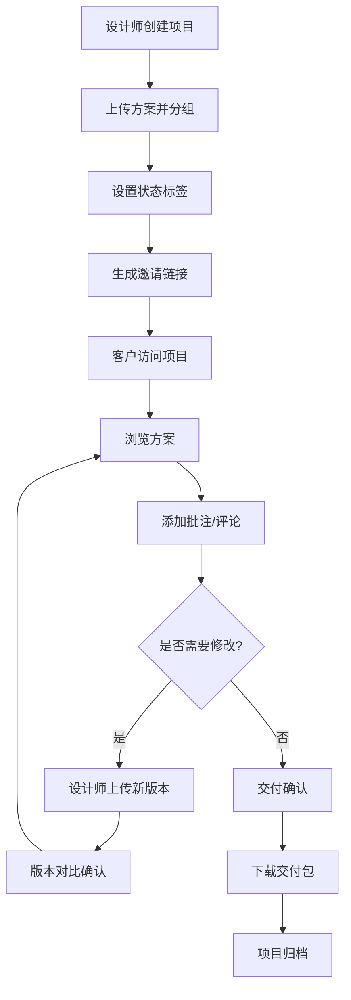

## 1. 产品概述

DesignFlow 是一个面向独立设计师的提案交付与反馈协作平台，解决设计师与客户之间反复发送零散图片、聊天记录混乱、版本追溯困难的问题。通过结构化的方案展示、精准的批注讨论、清晰的版本对比和规范的交付流程，让设计协作更加高效透明。

- 核心价值：将分散的沟通整合为结构化的协作流程，提升设计交付效率和客户满意度
- 目标用户：独立设计师、创意工作室、甲方客户及项目负责人

## 2. 核心功能

### 2.1 用户角色

| 角色 | 注册方式 | 核心权限 |
|------|----------|----------|
| 设计师 | 邮箱/手机号注册 | 创建项目、上传方案、组织内容、回复批注、版本管理、确认交付 |
| 客户 | 邀请链接访问 | 浏览方案、添加批注、提交评论、对比版本、确认验收 |

### 2.2 功能模块

1. **项目首页**：项目封面展示、基本信息、状态概览、时间线、修改回合记录
2. **方案浏览**：方案分组展示、按页面组织内容、图片预览与放大、状态标签
3. **批注讨论**：图片局部批注、文字评论、优先级标记、批注列表、回复功能
4. **版本对比**：版本切换、双栏对比、差异摘要、改动确认
5. **交付确认**：验收清单、确认通过、下载交付包、归档功能

### 2.3 页面详情

| 页面名称 | 模块名称 | 功能描述 |
|----------|----------|----------|
| 项目首页 | 封面展示 | 大图封面、项目标题、客户名称、项目周期 |
| 项目首页 | 状态概览 | 项目状态标签、进度百分比、批注数量、待确认项 |
| 项目首页 | 时间线 | 项目关键节点时间轴、版本更新记录、批注动态 |
| 项目首页 | 回合记录 | 修改回合列表、每回合内容概览、状态标记 |
| 方案浏览 | 分组导航 | 方案分组侧边栏、按页面/模块组织、展开收起 |
| 方案浏览 | 方案展示 | 卡片式布局、图片缩略图、状态标签、悬停效果 |
| 方案浏览 | 图片查看器 | 全屏放大、左右切换、缩放操作 |
| 批注讨论 | 画布批注 | 点击图片添加批注点、拖拽定位、批注标记显示 |
| 批注讨论 | 批注面板 | 批注列表、优先级筛选、状态筛选、搜索功能 |
| 批注讨论 | 评论区 | 文字评论、回复功能、用户头像、时间戳 |
| 批注讨论 | 优先级标记 | 高中低三档优先级、颜色区分、筛选排序 |
| 版本对比 | 版本选择器 | 版本下拉列表、版本标签、创建时间显示 |
| 版本对比 | 双栏对比 | 左右分栏同步滚动、差异高亮、关联批注 |
| 版本对比 | 差异摘要 | 改动点列表、分类统计、确认状态 |
| 交付确认 | 验收清单 | 交付内容列表、逐项确认、完成状态 |
| 交付确认 | 确认通过 | 一键确认、签名/备注、时间记录 |
| 交付确认 | 下载交付 | 交付包下载、文件列表、格式说明 |

## 3. 核心流程

### 3.1 设计提案交付流程

设计师上传设计方案，按页面组织内容并设置状态标签。客户通过邀请链接进入项目，在方案浏览页查看所有设计稿，可点击放大查看细节。在批注讨论页，客户可直接在图片上添加局部批注，标记优先级并附上文字说明，设计师可进行回复和状态更新。当需要修改时，设计师上传新版本，双方在版本对比页查看差异并确认改动。最终在交付确认页完成验收、下载源文件并归档。

### 3.2 流程图

## 4. 用户界面设计

### 4.1 设计风格

**设计方向：极简编辑风格（Editorial Minimalism）**

这是一个面向设计师的专业协作工具，需要体现设计感和专业性，同时保持界面简洁不喧宾夺主，让设计方案成为视觉焦点。

- **主色调**：深邃炭灰 `#1A1A1A`（作为品牌色，体现专业与沉稳）
- **点缀色**：暖橘色 `#FF6B35`（用于关键操作和强调元素）
- **辅助色**：薄荷绿 `#4ECDC4`（通过/确认状态）、暖黄 `#FFE66D`（待处理）、珊瑚红 `#FF6B6B`（需修改）
- **中性色**：米白 `#FAFAF8`（背景）、浅灰 `#F0F0ED`（分隔）、中灰 `#8A8A8A`（次要文字）、深灰 `#2D2D2D`（主要文字）

**字体选择**：
- 标题字体：`Cormorant Garamond`（优雅的衬线字体，体现设计品质）
- 正文字体：`Space Grotesk`（现代几何无衬线，兼具个性与可读性）
- 等宽字体：`JetBrains Mono`（用于标签、状态等功能性文字）

**设计细节**：
- 按钮：极简设计，细边框 + 悬停填充过渡，圆角 2px
- 卡片：无边框设计，微妙的投影，悬停时轻微上浮
- 布局：大量留白，不对称网格，强调内容层级
- 装饰元素：细线条分隔、极小的圆点标记、优雅的下划线
- 背景：米白色基底，极细的噪点纹理，营造纸质感

### 4.2 页面设计概览

| 页面名称 | 模块名称 | UI 元素 |
|----------|----------|----------|
| 项目首页 | 封面展示 | 全屏宽度封面图、项目标题大字排版、客户信息小字、优雅的渐变叠加 |
| 项目首页 | 状态概览 | 三个状态卡片横向排列、数字强调、进度条使用暖橘色 |
| 项目首页 | 时间线 | 左侧竖线、圆点节点、日期左对齐、内容卡片右侧错落 |
| 方案浏览 | 分组导航 | 左侧固定侧边栏、分组标题大写、激活项左侧竖线标记 |
| 方案浏览 | 方案展示 | 响应式网格、卡片悬停上浮、状态标签右上角定位 |
| 批注讨论 | 画布批注 | 图片居中显示、批注点为带序号的圆圈、点击展开批注面板 |
| 批注讨论 | 批注面板 | 右侧抽屉式面板、优先级彩色圆点标记、评论区缩进样式 |
| 版本对比 | 双栏对比 | 50/50 分栏、中间可拖拽分隔线、同步滚动联动 |
| 交付确认 | 验收清单 | 列表样式、复选框自定义为对勾动画、完成项灰色删除线 |

### 4.3 响应式设计

- **桌面端**：1280px 起，侧边栏 + 主内容区双栏布局
- **平板端**：768px - 1280px，侧边栏可收起为图标模式
- **移动端**：375px - 768px，单栏布局，顶部标签页切换，底部导航
- 触控优化：增大点击区域至 44px，支持双指缩放图片，滑动切换图片

### 4.4 动画与交互

- 页面加载：内容从下至上渐入，错落延迟 100ms
- 图片悬停：轻微放大 1.02 倍，投影加深
- 批注点：脉冲呼吸动画提示
- 抽屉面板：从右侧滑入，背景遮罩渐显
- 状态变更：颜色过渡动画，300ms 缓动
- 滚动：平滑滚动，时间线节点滚动到视口时渐入
