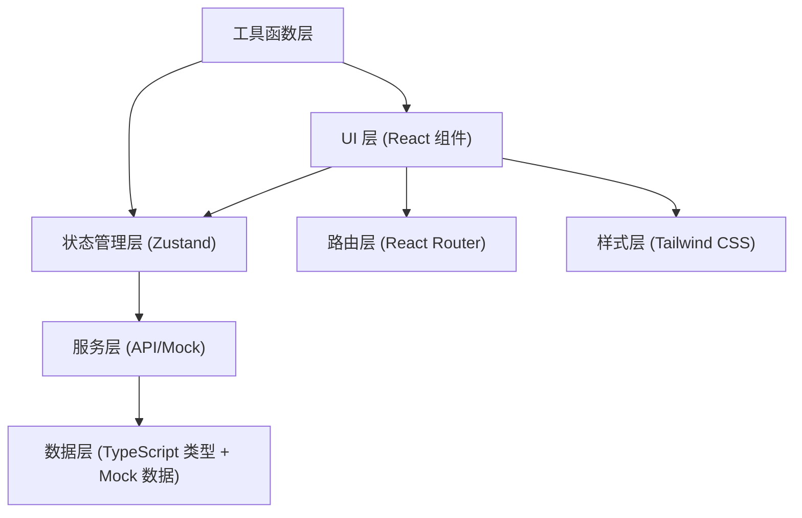

## 1. 架构设计

本项目为纯前端单页应用，使用 Mock 数据模拟后端接口，无需真实后端服务。整体采用分层架构，确保代码可维护性和扩展性。



## 2. 技术描述

### 2.1 技术栈选择

- **前端框架**：React 18 + TypeScript 5
- **构建工具**：Vite 5
- **路由管理**：React Router v6
- **状态管理**：Zustand（轻量级状态管理，适合中小规模应用）
- **样式方案**：Tailwind CSS v3
- **图标库**：Lucide React（简洁的线性图标）
- **动画库**：Framer Motion（流畅的动画效果）
- **图片查看**：自定义实现 Lightbox 组件

### 2.2 项目结构

```
src/
├── assets/              # 静态资源
│   ├── images/          # 图片资源
│   └── fonts/           # 字体文件
├── components/          # 公共组件
│   ├── layout/          # 布局组件
│   ├── ui/              # 基础 UI 组件
│   └── features/        # 业务组件
├── pages/               # 页面组件
│   ├── Home.tsx         # 项目首页
│   ├── Browse.tsx       # 方案浏览
│   ├── Comments.tsx     # 批注讨论
│   ├── Compare.tsx      # 版本对比
│   └── Delivery.tsx     # 交付确认
├── store/               # 状态管理
│   └── useProjectStore.ts
├── data/                # Mock 数据
│   └── mockData.ts
├── types/               # TypeScript 类型定义
│   └── index.ts
├── utils/               # 工具函数
│   └── helpers.ts
├── hooks/               # 自定义 Hooks
├── App.tsx
├── main.tsx
└── index.css
```

## 3. 路由定义

| 路由路径 | 页面名称 | 说明 |
|----------|----------|------|
| `/` | 项目首页 | 项目概览、时间线、状态统计 |
| `/browse` | 方案浏览 | 方案分组展示、图片查看器 |
| `/comments` | 批注讨论 | 图片批注、评论区、优先级管理 |
| `/compare` | 版本对比 | 双栏对比、版本切换、差异摘要 |
| `/delivery` | 交付确认 | 验收清单、下载交付、归档 |

## 4. 数据模型

### 4.1 类型定义

```typescript
// 项目基本信息
interface Project {
  id: string;
  title: string;
  client: string;
  description: string;
  coverImage: string;
  startDate: string;
  endDate: string;
  status: 'draft' | 'review' | 'revision' | 'approved' | 'delivered';
  progress: number;
}

// 方案分组
interface DesignGroup {
  id: string;
  name: string;
  description: string;
  designs: Design[];
}

// 设计方案
interface Design {
  id: string;
  title: string;
  description: string;
  imageUrl: string;
  version: number;
  status: 'pending' | 'approved' | 'revision';
  annotations: Annotation[];
  createdAt: string;
}

// 批注
interface Annotation {
  id: string;
  designId: string;
  x: number; // 百分比位置
  y: number;
  content: string;
  priority: 'low' | 'medium' | 'high';
  status: 'open' | 'resolved' | 'closed';
  author: User;
  comments: Comment[];
  createdAt: string;
}

// 评论
interface Comment {
  id: string;
  annotationId: string;
  content: string;
  author: User;
  createdAt: string;
}

// 用户
interface User {
  id: string;
  name: string;
  role: 'designer' | 'client';
  avatar: string;
}

// 版本记录
interface Version {
  id: string;
  number: number;
  name: string;
  description: string;
  designIds: string[];
  createdAt: string;
  changes: ChangeItem[];
}

// 改动项
interface ChangeItem {
  id: string;
  type: 'added' | 'modified' | 'removed';
  description: string;
  designId?: string;
  confirmed: boolean;
}

// 时间线节点
interface TimelineEvent {
  id: string;
  type: 'version' | 'annotation' | 'status' | 'delivery';
  title: string;
  description: string;
  date: string;
  user: User;
}

// 交付项
interface DeliveryItem {
  id: string;
  name: string;
  description: string;
  fileType: string;
  fileSize: string;
  completed: boolean;
}
```

### 4.2 Mock 数据结构

项目使用 Mock 数据模拟真实业务场景，包含：
- 1 个完整的品牌设计项目
- 3 个设计分组（首页、产品页、关于页）
- 8 个设计方案，每个方案有 2-3 个版本
- 12 个批注，分布在不同设计稿上
- 3 个版本记录，包含详细的改动摘要
- 8 个时间线节点
- 6 个交付项

## 5. 核心功能实现方案

### 5.1 图片批注系统

- 使用相对坐标（百分比）记录批注位置，确保响应式适配
- 批注点采用 SVG 绘制，带有序号和脉冲动画
- 点击批注点展开右侧抽屉面板，显示详情和评论
- 支持优先级筛选和状态筛选

### 5.2 版本对比

- 双栏布局，左右各显示一个版本的设计图
- 实现同步滚动（滚动其中一侧，另一侧跟随）
- 中间可拖拽分隔线调整两边比例
- 差异点使用高亮标记，点击可跳转查看

### 5.3 图片查看器 (Lightbox)

- 点击图片缩略图全屏显示
- 支持键盘导航（左右箭头切换，ESC 关闭）
- 支持缩放（滚轮/按钮）和平移拖拽
- 显示图片标题和版本信息

### 5.4 状态管理

- 使用 Zustand 管理全局项目状态
- 包含项目信息、设计方案、批注、版本等数据
- 提供更新批注状态、添加评论、切换版本等操作方法
- 支持状态持久化（localStorage）

## 6. 性能优化

- 图片懒加载：使用 Intersection Observer 实现
- 路由懒加载：React Router 动态导入
- 组件 memo 优化：避免不必要的重渲染
- 虚拟列表：批注列表数量多时采用虚拟化
- 字体优化：使用 font-display: swap 避免 FOIT
